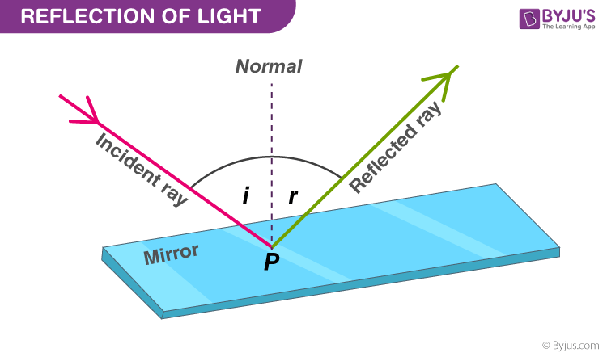
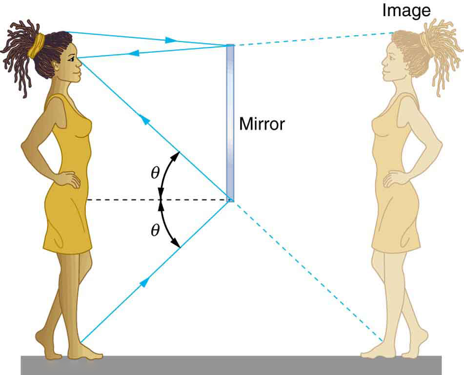
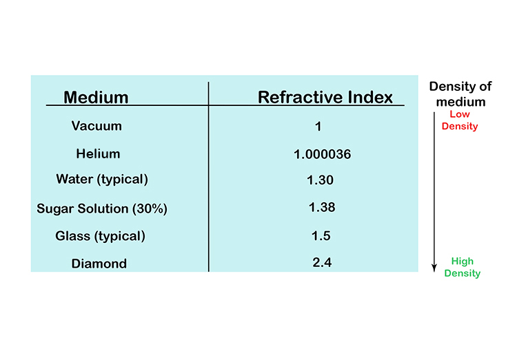
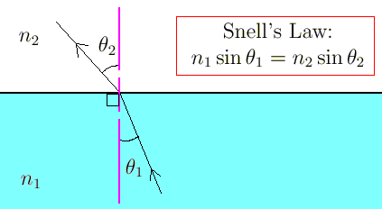
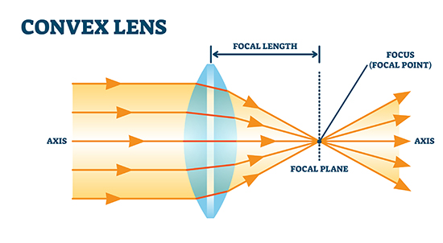
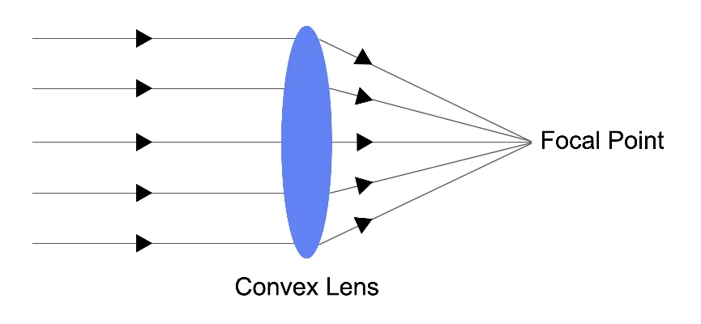
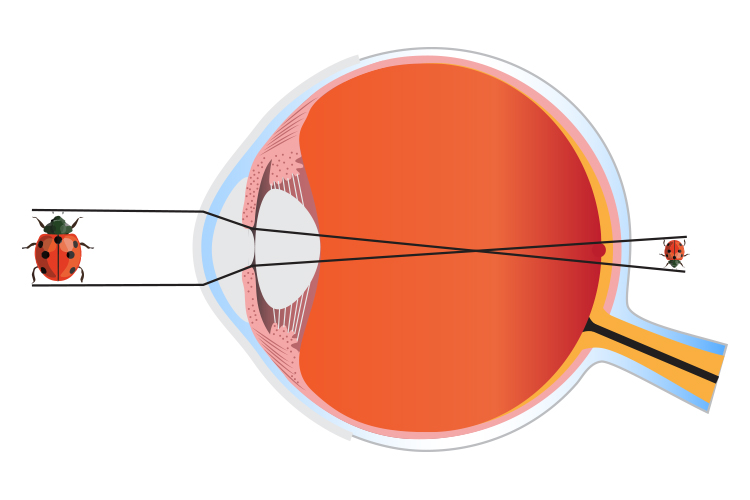

## Optics Topics
A microscope is a type of optical device that allows the human eye to see tiny objects or microbes. They use multiple optics concepts to work
### Reflection
Reflection is when light waves are not absorbed into the medium and bounces in accordance to the surface. Using Fermat principle, the reflection angle can be determined by the pathway of the light, point of reflection and angle of initial light path. Typically the angle of reflection is the same to the angle of the original angle

Reflection is used in mirrors, where the image is reflected on a lens and from that point, a inverted image can be see on the reflected ray.

### Refraction
In air, light travels at a certain speed or index, Refraction refers to the behaviors of light in different mediums. light behaves differently based on the substances optical density or refractive index

if the index is smaller then the light travels faster, and typically have a lower density. While if the light is traveling through a slow medium and the light is slower then the reflective index is higher.
Snells law related to Fermat's equation by way of defining the angle of incidence proportional to the angle of refraction between the different media.

### Different Types of Lenses
#### Convex Lens

Convex lens are a type of converging lens, where the focal point is **after** the lens, and focuses on a certain point. the focal length in the difference of the initial lens and the focal point. The lens strength or power is the inverse of the focal length and determines the power of the lens

#### Concave Lens
concave lens are types of diverging lenses, where the light rays are refracted, instead of having the focal point, concave lens have a virtual focal point, **before** the refraction of light occurs

### Appearance of Images
Since microscopes are supposed to model the human eye so images are in an upside down inverted order, so something the moves left on a microscope is actually moving right

